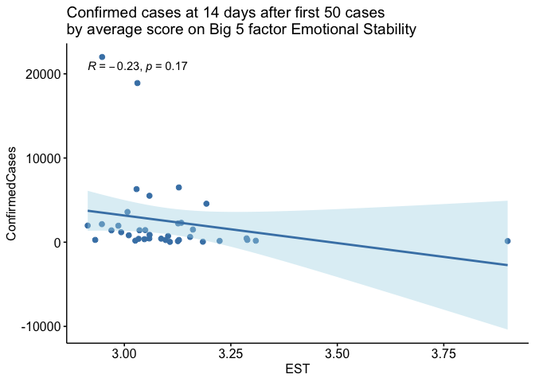

COVID-19 and the Big 5 Personality Test
================

#### A Replication of <https://tylerburleigh.com/blog/covid-19-and-the-big-5-personality-test/>

##### by Lital, Intithar, and Louis

Tyler Burleigh poses the question: Does the growth in COVID-19 cases
have anything to do with Big 5 Personality traits?

Here we replicate his work in R, fixing some minor mistakes and adding a
bonus visualization.

``` r
library(tidyverse)
```

    ── Attaching core tidyverse packages ──────────────────────── tidyverse 2.0.0 ──
    ✔ dplyr     1.1.2     ✔ readr     2.1.4
    ✔ forcats   1.0.0     ✔ stringr   1.5.0
    ✔ ggplot2   3.4.2     ✔ tibble    3.2.1
    ✔ lubridate 1.9.2     ✔ tidyr     1.3.0
    ✔ purrr     1.0.1     
    ── Conflicts ────────────────────────────────────────── tidyverse_conflicts() ──
    ✖ dplyr::filter() masks stats::filter()
    ✖ dplyr::lag()    masks stats::lag()
    ℹ Use the conflicted package (<http://conflicted.r-lib.org/>) to force all conflicts to become errors

``` r
library(lubridate)
library(ggpubr) # for easy plotting later

# load preprocessed data
load("processed_data.RData")
```

## COVID Data Preprocessing

Since the raw data is too large to upload to Github, the code here is
just for display. The final preprocessed data can be found in
`processed_data.RData`.

``` r
# Import Data
covid <- read_csv("train.csv")

# Select the columns we need
covid <- covid %>% 
  arrange(`Country/Region`, Date) %>% 
  rename(country = `Country/Region`, date = Date, cases = ConfirmedCases) %>% 
  group_by(country, date) %>% 
  summarise(cases = sum(cases)) %>% 
  select(country, date, cases)

covid <- covid %>% 
  # Filter only countries with at least 50 cases
  # (this will also cut out all days before arriving at 50 cases)
  group_by(country) %>% 
  filter(cummax(cases) >= 50) %>% 
  # ...and at least 14 days of data afterwards 
  # (this will happen automatically when a country has no value for day 14)
  arrange(country, date) %>% 
  mutate(day = 1:n()) %>%
  filter(day %in% c(1, 14)) %>% 
  pivot_wider(id_cols = 'country', names_from = 'day', values_from = 'cases', names_prefix = "cases_day") %>% 
  # compute growth over 14 days
  mutate(growth = cases_day14 - cases_day1) %>% 
  drop_na()
```

## Big 5 Data Preprocessing

``` r
# Note: filepath should be changed as needed
bigfive <- read_tsv("bigfive_data.csv")
bigfive <- bigfive %>% select(EXT1:OPN10, country) %>% 
  mutate(across(-country, as.numeric))

negatively_keyed = c('EXT2', 'EXT4', 'EXT6', 'EXT8', 'EXT10',
                    'EST2', 'EST4',
                    'AGR1', 'AGR3', 'AGR5', 'AGR7', 
                    'CSN2', 'CSN4', 'CSN6', 'CSN8', 
                    'OPN2', 'OPN4', 'OPN6')

# WARNING: this takes a long time to run
bigfive <- bigfive %>% 
  # reverse negatively keyed variables
  mutate(across(negatively_keyed, ~(6-.x))) %>% 
  # average each trait within individual
  mutate(EXT = rowMeans(pick(EXT1:EXT10), na.rm = TRUE),
         EST = rowMeans(pick(EST1:EST10), na.rm = TRUE),
         AGR = rowMeans(pick(AGR1:AGR10), na.rm = TRUE),
         CSN = rowMeans(pick(CSN1:CSN10), na.rm = TRUE),
         OPN = rowMeans(pick(OPN1:OPN10), na.rm = TRUE)) %>% 
  select(EXT:OPN, country)

bigfive <- bigfive %>% 
  # average by country, noting how many cases are in each
    # (we'll keep countries with 1000 or fewer cases for now, 
    # just in case we want them for visualization down the line)
  # just for kicks, lets take note of standard deviation too
  group_by(country) %>% 
  summarise(EXT_sd = sd(EXT, na.rm = TRUE),
            EST_sd = sd(EST, na.rm = TRUE),
            AGR_sd = sd(AGR, na.rm = TRUE),
            CSN_sd = sd(CSN, na.rm = TRUE),
            OPN_sd = sd(OPN, na.rm = TRUE),
            
            EXT = mean(EXT, na.rm = TRUE),
            EST = mean(EST, na.rm = TRUE),
            AGR = mean(AGR, na.rm = TRUE),
            CSN = mean(CSN, na.rm = TRUE),
            OPN = mean(OPN, na.rm = TRUE),
            
            n = n()) 

# Import country codes
country_codes <- read_csv("country_codes.csv") %>% select(1:2) %>% 
  rename(country = `English short name lower case`,
         code = `Alpha-2 code`)

# Put all the data together
unified_data <- bigfive %>% 
  rename(code = country) %>% 
  left_join(country_codes) %>% 
  # I'm noticing that not all names match up, so we'll need to change a couple manually before the big join
  mutate(country = case_when(country == 'United States Of America' ~ 'US',
                             country == 'Korea, Republic of (South Korea)' ~ 'Korea, South',
                             .default = country)) %>% 
  right_join(covid)
```

## Original Plots

``` r
EXT_PLOT <- ggscatter(unified_data, x = "EXT", y = "growth", 
                      title = "Confirmed cases at 14 days after first 50 cases \nby average score on Big 5 factor Extraversion ", color = "steelblue",
                      add = "reg.line", conf.int = TRUE, 
                      cor.coef = TRUE, cor.method = "pearson",
                      xlab = "EXT", ylab = "ConfirmedCases",
                      add.params = list(color = "steelblue", fill = "lightblue"))
EXT_PLOT
```


``` r
EST_PLOT <- ggscatter(unified_data, x = "EST", y = "growth", 
                      title = "Confirmed cases at 14 days after first 50 cases \nby average score on Big 5 factor Emotional Stability ", color = "steelblue",
                      add = "reg.line", conf.int = TRUE, 
                      cor.coef = TRUE, cor.method = "pearson",
                      xlab = "EST", ylab = "ConfirmedCases",
                      add.params = list(color = "steelblue", fill = "lightblue"))
EST_PLOT
```



``` r
AGR_PLOT <- ggscatter(unified_data, x = "AGR", y = "growth", 
                      title = "Confirmed cases at 14 days after first 50 cases \nby average score on Big 5 factor Agreeableness ", color = "steelblue",
                      add = "reg.line", conf.int = TRUE, 
                      cor.coef = TRUE, cor.method = "pearson",
                      xlab = "AGR", ylab = "ConfirmedCases",
                      add.params = list(color = "steelblue", fill = "lightblue"))
AGR_PLOT
```


``` r
CSN_PLOT <- ggscatter(unified_data, x = "CSN", y = "growth", 
                      title = "Confirmed cases at 14 days after first 50 cases \nby average score on Big 5 factor Conscientiousness ", color = "steelblue",
                      add = "reg.line", conf.int = TRUE, 
                      cor.coef = TRUE, cor.method = "pearson",
                      xlab = "CSN", ylab = "ConfirmedCases",
                      add.params = list(color = "steelblue", fill = "lightblue"))
CSN_PLOT
```


``` r
OPN_PLOT <- ggscatter(unified_data, x = "OPN", y = "growth", 
                      title = "Confirmed cases at 14 days after first 50 cases \nby average score on Big 5 factor Openness ", color = "steelblue",
                      add = "reg.line", conf.int = TRUE, 
                      cor.coef = TRUE, cor.method = "pearson",
                      xlab = "OPN", ylab = "ConfirmedCases",
                      add.params = list(color = "steelblue", fill = "lightblue"))
OPN_PLOT
```


## Original Plots, Now With Outliers Removed

``` r
# Lets drop China and USA (outliers) and plot again
unified_data_without_china_usa <- unified_data %>% filter(!country %in% c('US', 'China'))

EXT_PLOT <- ggscatter(unified_data_without_china_usa, x = "EXT", y = "growth", 
                      title = "Confirmed cases at 14 days after first 50 cases \nby average score on Big 5 factor Extraversion ", color = "steelblue",
                      add = "reg.line", conf.int = TRUE, 
                      cor.coef = TRUE, cor.method = "pearson",
                      xlab = "EXT", ylab = "ConfirmedCases",
                      add.params = list(color = "steelblue", fill = "lightblue"))
EXT_PLOT
```


``` r
EST_PLOT <- ggscatter(unified_data_without_china_usa, x = "EST", y = "growth", 
                      title = "Confirmed cases at 14 days after first 50 cases \nby average score on Big 5 factor Emotional Stability ", color = "steelblue",
                      add = "reg.line", conf.int = TRUE, 
                      cor.coef = TRUE, cor.method = "pearson",
                      xlab = "EST", ylab = "ConfirmedCases",
                      add.params = list(color = "steelblue", fill = "lightblue"))
EST_PLOT
```


``` r
AGR_PLOT <- ggscatter(unified_data_without_china_usa, x = "AGR", y = "growth", 
                      title = "Confirmed cases at 14 days after first 50 cases \nby average score on Big 5 factor Agreeableness ", color = "steelblue",
                      add = "reg.line", conf.int = TRUE, 
                      cor.coef = TRUE, cor.method = "pearson",
                      xlab = "AGR", ylab = "ConfirmedCases",
                      add.params = list(color = "steelblue", fill = "lightblue"))
AGR_PLOT
```


``` r
CSN_PLOT <- ggscatter(unified_data_without_china_usa, x = "CSN", y = "growth", 
                      title = "Confirmed cases at 14 days after first 50 cases \nby average score on Big 5 factor Conscientiousness ", color = "steelblue",
                      add = "reg.line", conf.int = TRUE, 
                      cor.coef = TRUE, cor.method = "pearson",
                      xlab = "CSN", ylab = "ConfirmedCases",
                      add.params = list(color = "steelblue", fill = "lightblue"))
CSN_PLOT
```


``` r
OPN_PLOT <- ggscatter(unified_data_without_china_usa, x = "OPN", y = "growth", 
                      title = "Confirmed cases at 14 days after first 50 cases \nby average score on Big 5 factor Openness ", color = "steelblue",
                      add = "reg.line", conf.int = TRUE, 
                      cor.coef = TRUE, cor.method = "pearson",
                      xlab = "OPN", ylab = "ConfirmedCases",
                      add.params = list(color = "steelblue", fill = "lightblue"))
OPN_PLOT
```


